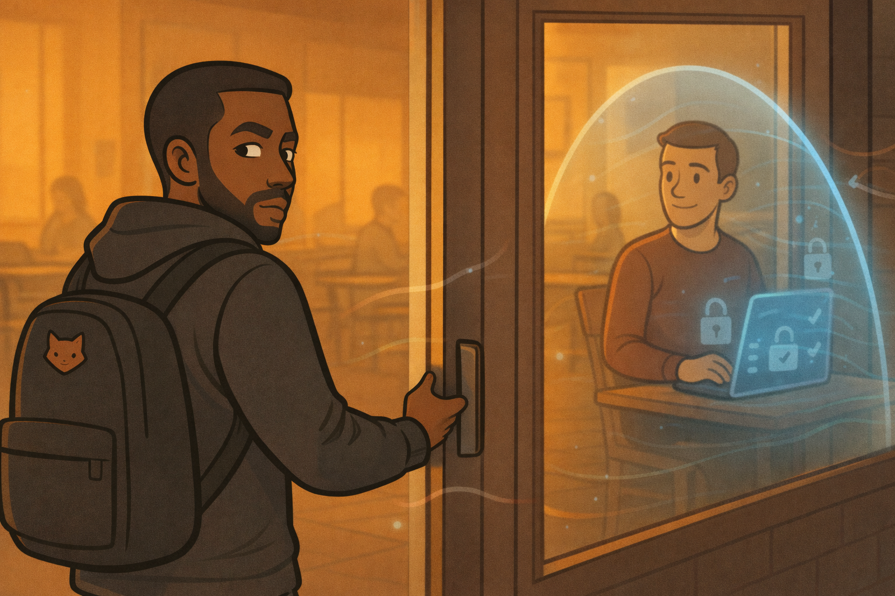
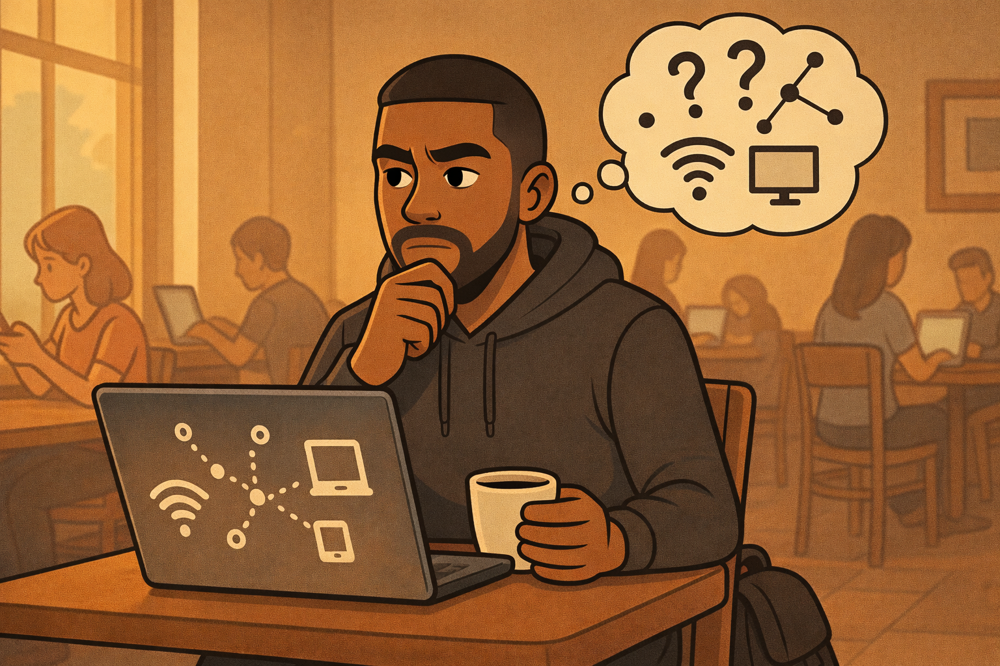
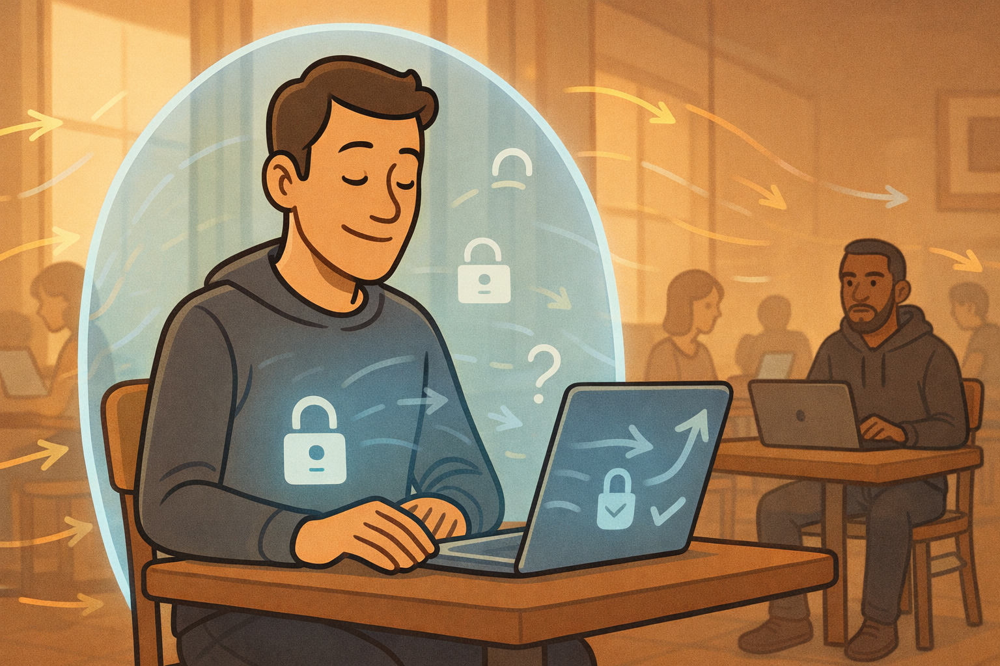
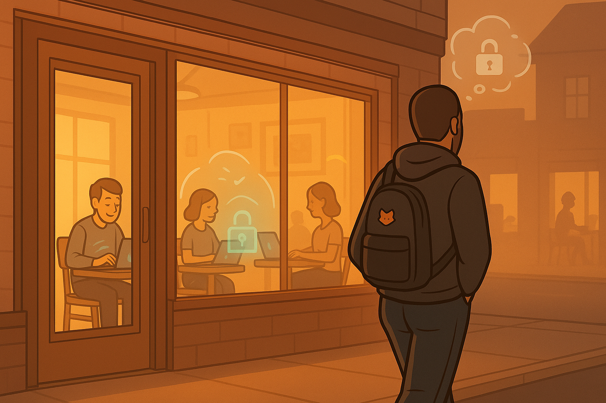

> *“Most attacks don’t start with chaos.  
They start with someone quietly paying attention.”*

---

## 🦊 Issue #1  
# ShadowFox steps into **NeoComics Café**.

  

Backpack light.  
Hood down.  
Laptop clean.  

Nothing about him announces danger.

**In his head:**

> *“Relax. Blend in. Order something cheap.  
The quieter I look, the louder the network speaks.”*

  

He scans the room the way others scan menus.

Laptops.  
Phones.  
People trusting a lock icon they didn’t configure themselves.

### 🛡 Defender’s Lens  
Public Wi-Fi isn’t evil.  
It’s just **honest**.

It doesn’t know who you are.  
It doesn’t protect you by default.

That’s where mistakes begin.

---

## 🔍 Phase 1 — Recon  
### *“What’s in this room with me?”*

  

ShadowFox connects to **NeoComics_Free_WiFi**.

No password.  
No friction.  
Instant access.

**In his head:**

> *“Alright… let’s see who showed up to the party.”*

His laptop gets an IP address.  
That’s the invite.

He opens a familiar recon tool — something lightweight, quiet.  
A network scanner.

**In his head:**

> *“I don’t need names yet.  
Just faces.  
Who’s alive. Who answers back.”*

This is where tools like **Nmap** live in his world —  
not as weapons, but as **flashlights**.



They don’t break things.  
They ask questions.

*Who’s there?*  
*Who responds?*  
*Who left a door unlocked?*

### 🛡 Defender’s Lens

A blue-team mindset assumes this phase exists.

That’s why good networks:

- Enable **client isolation**
- Block device-to-device chatter
- Treat every connection as temporary trust

Recon only works when the room talks back.

---

## 📡 Phase 2 — Traffic Awareness  
### *“What’s everyone talking about?”*



The air is busy.

Packets everywhere.

ShadowFox doesn’t read messages —  
he watches **patterns**.

**In his head:**

> *“I don’t care what you’re saying.  
I care whether you’re whispering or shouting.”*

He opens a packet-viewing tool — something like **Wireshark**,  
not to steal, but to **observe flow**.

**In his head:**

  

> *“Encrypted traffic is just noise to me.  
But noise tells me who’s disciplined.”*

He watches for:

- Plain HTTP requests
- Repeated DNS lookups
- Devices that talk too much

### 🛡 Defender’s Lens

This phase collapses instantly when:

- HTTPS is everywhere
- VPNs wrap traffic end-to-end
- Certificate warnings are respected

Encryption doesn’t stop attackers.  
It **bores** them.

---

## 🎭 Phase 3 — Positioning  
### *“Could I stand in the hallway?”*



ShadowFox leans back.

He’s not rushing.

**In his head:**

> *“Every network has a hallway.  
The question is whether anyone’s guarding it.”*

He considers ARP — the protocol devices use to say  
*“Hey, who’s the router?”*

In his world, tools exist that **lie politely** about that.

**In his head:**



> *“If they believe I’m the door,  
they’ll walk through me.”*

This isn’t smashing locks.  
It’s exploiting **assumptions**.

### 🛡 Defender’s Lens

Modern defenses expect this:

- VPNs encrypt traffic even if intercepted
- Secure Wi-Fi gear detects ARP abuse
- Systems reject tampered certificates

Trust without verification is the real vulnerability.

---

## 🧪 Phase 4 — Target Selection  
### *“Not everyone. Just one.”*



ShadowFox scans his mental list.

Phones.  
Laptops.  
That one machine still running old software.

**In his head:**



> *“I don’t need the strongest system.  
I need the most tired one.”*

He correlates traffic with behavior.

Tools don’t decide targets.  
**People do.**

### 🛡 Defender’s Lens

Strong habits erase profiles:

- MFA on accounts
- Up-to-date systems
- No sensitive logins on public Wi-Fi

Attackers hunt shortcuts, not skill.

---

## 🧨 Phase 5 — Opportunity  
### *“Has history already solved this for me?”*



ShadowFox notices a service version.

He doesn’t guess.

He checks memory — databases of known mistakes.

**In his head:**

> *“Someone else already broke this once.  
I just need to know if they fixed it.”*

This is where vulnerability databases come in —  
not hacking manuals, but **archives of lessons learned the hard way**.

### 🛡 Defender’s Lens

Most real-world compromises happen because:

- Updates were postponed
- Warnings were ignored
- “Later” became permanent

Patching isn’t exciting.

That’s why it works.

---

## 🧹 Phase 6 — Exit  
### *“Leave like you were never here.”*



ShadowFox closes his laptop.

No alarms.  
No drama.

**In his head:**

> *“Observation complete.  
No need to touch anything.”*



He leaves.

That restraint is the difference between curiosity and chaos.

---

## 🛡 What This Episode Teaches  
### *Thinking Like a Defender*

This story isn’t about becoming ShadowFox.

It’s about becoming **uninteresting** to him.

Instead of asking:  
*“How would I hack this?”*

(which leads you to think about exploits, tricks, clever attacks)

Ask:  
*“What defenses would make an attacker skip this system and move on?”*

### Personal Defense Checklist

1. Use a VPN on public Wi-Fi  
2. Disable auto-connect to open networks  
3. Keep systems updated  
4. Use MFA everywhere it matters  
5. Avoid sensitive logins on public networks  

Security isn’t fear.

It’s foresight.

---

## ⚠️ Ethical Reality Check

Everything ShadowFox does here **must only be practiced in authorized environments**.

Trying this on real networks without permission is illegal and unethical.

If you want to **learn reconnaissance the right way**, use platforms built for it:

- **TryHackMe** — guided, beginner-friendly, blue-team aware  
- **Hack The Box** — controlled labs that reward discipline, not recklessness  

These environments exist so curiosity doesn’t become harm.

---

> *“The safest person in the room  
is the one who assumes they’re already being observed.”*

---

  

🦊 **Next Issue:**  
*When observation isn’t enough — and impatience enters the room.*
