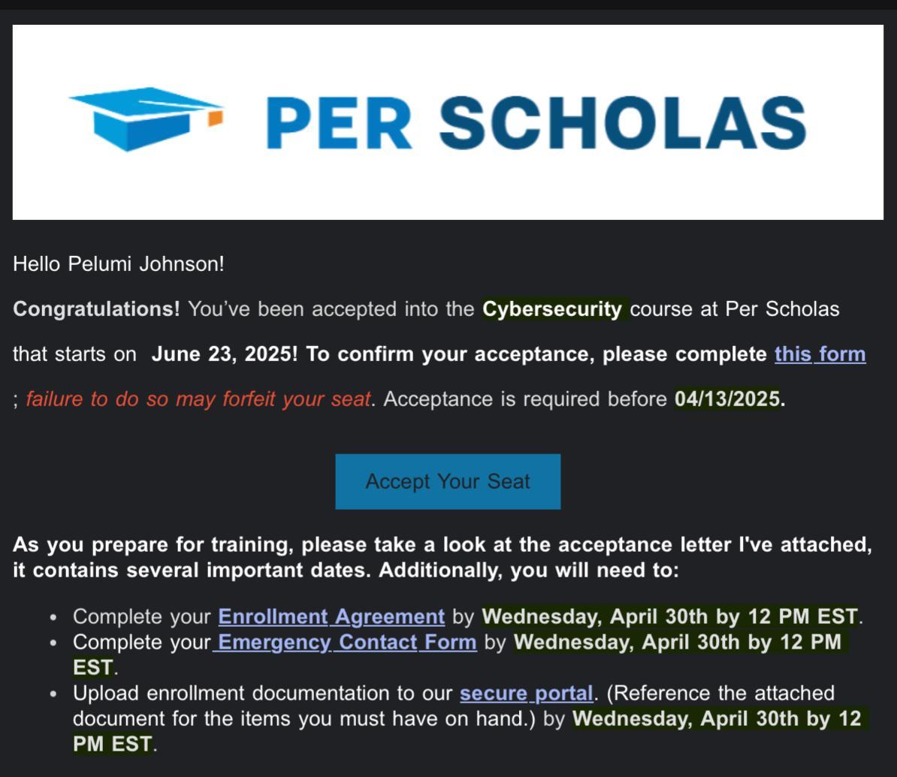
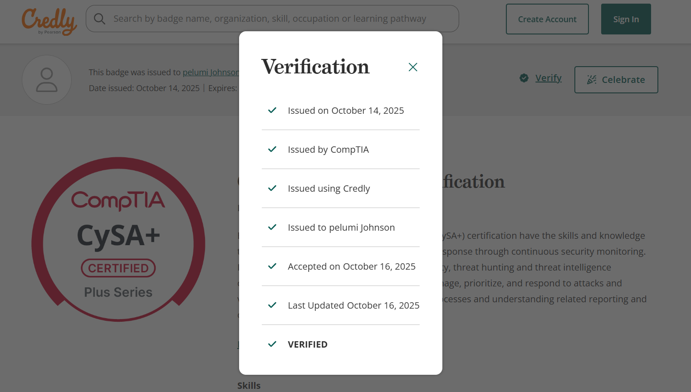
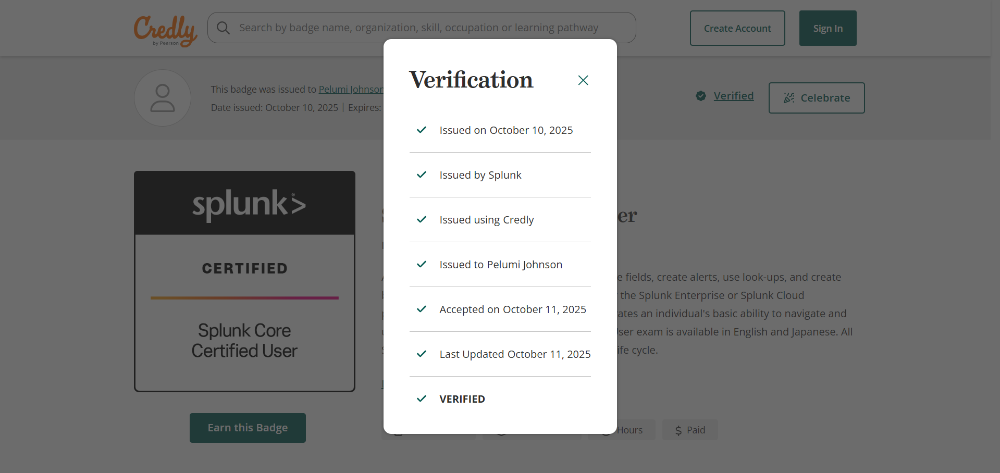
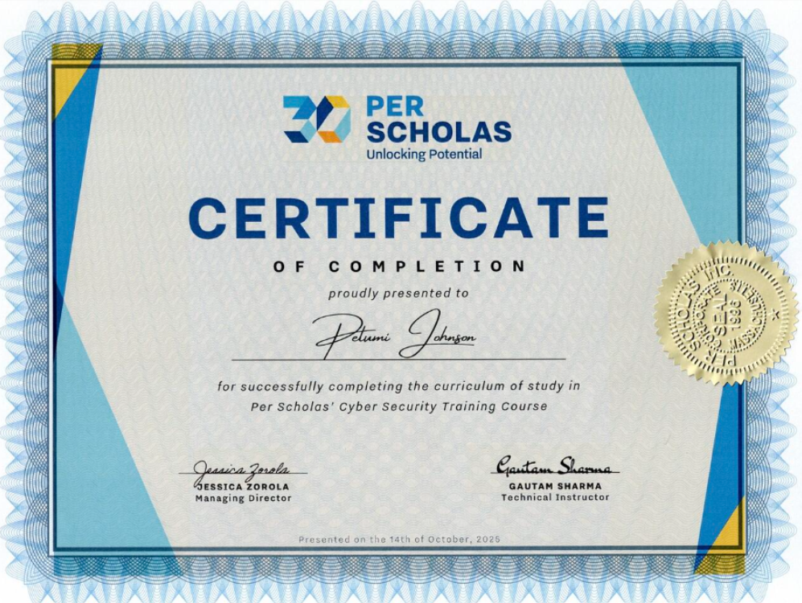

## A Degree, But No Direction

I graduated college with a degree in Sociology.

On paper, that should have felt like an achievement.  
In reality, I felt empty.

I didn’t feel aligned with the degree. I didn’t see a clear path forward. I had no real motivation, no excitement, and no sense of direction. I felt lost not just professionally, but internally.

So I did the only thing I knew to do at that point.

I prayed.  
I reflected.  
I searched for clarity instead of forcing momentum.

I was tired of guessing and tired of walking paths that looked right on the outside but felt wrong on the inside.

## Searching for Fit

Like many people in that season, I experimented.

I took personality tests.  
I explored career fit platforms.  
I tried learning software engineering and coding to see if it was my thing.

At first, I genuinely enjoyed it. But I wasn’t consistent not because it was difficult, but because I still wasn’t sure. I didn’t want another path that looked impressive but lacked alignment.

I wasn’t chasing opportunity alone.  
I was searching for fit.

## The Unexpected Door

One day, a friend sent me an Instagram video.

It was talking about a free, hands on tech program. No tuition. No shortcuts. Just real training.

That stopped me.

The video led me to Per Scholas.

Something about it felt different. Practical. Grounded. Real.

I went through the application process, completed the requirements, and eventually sat for the interview.

And honestly, I was excited.

Not just nervous excited, but grateful excited. I felt honored just to be considered. I knew I had chosen a harder path by stepping directly into cybersecurity instead of starting with what most people would recommend like IT technician roles. I had skipped the “easy entry” and aimed straight for something more demanding.

It felt like starting from senior year and working backward through junior and sophomore concepts until everything finally made sense.

Even before joining the program, I had already taken a step of faith:  
I had applied for — and been accepted into — a second bachelor’s degree in **Cybersecurity**.

I didn’t fully know where this road would lead, but I knew I couldn’t stay where I was.

## Choosing the Narrow Road

When I was accepted into the **Per Scholas Cybersecurity Analyst program**, I made a decision.

I paused school.

I committed fully to a **15-week, intensive, rigorous cybersecurity training** — no shortcuts, no half-measures.

That summer changed me.

The program was demanding. It pushed me mentally, technically, and professionally. But something surprising happened along the way.

I loved it.

Learning cybersecurity didn’t feel like forcing myself to study. It felt like solving puzzles. Like thinking deeply. Like playing strategy games that required patience, logic, and awareness.

For the first time, learning felt natural.

Cybersecurity became a way to serve.

I understood something important.

Whatever I pursue in life has to center on helping people.
Cybersecurity gave me that opportunity.  
A skill I enjoy.  

And a tool to serve with purpose.

## Growth, Discipline, and Community

Beyond the technical skills, I met incredible people. The tutors didn’t just teach cybersecurity. They made it approachable. Something you could sit with. Something you could enjoy learning.

[Gautam](https://www.linkedin.com/in/gothamjsharma/) and [Aurbon](https://www.linkedin.com/in/aubornabiera/) had a way of breaking complex ideas down until they felt simple. Until they made sense. Learning stopped feeling heavy and started feeling engaging.

Alongside the technical work, Dellon guided us through professional development. Resume building. Personal branding. Learning how to tell our stories with clarity and confidence.

That guidance set the foundation.

But the momentum came from the people walking beside me.

A group of driven, committed students. Different backgrounds. One direction.

We burned the midnight candle together.  
We studied relentlessly.  
We shared notes, resources, labs, and encouragement.

When the time came to prepare for the CompTIA CySA exam and the Splunk certification, we used every resource we could get our hands on. Practice questions. Labs. Documentation. Whiteboarding. Group reviews.

We didn’t just study alone. We studied together.

Cybersecurity taught me more than technical skills. It taught collaboration, resilience, and how powerful focused community can be.

Even now, we still plan together. Talking through the next CompTIA exams to conquer. Supporting each other’s growth. Pushing forward as a team.

That sense of shared purpose turned learning into momentum.

Not long after, the late nights paid off again.

---

Passing the CySA exam wasn’t just about a credential. It validated that the effort mattered. That I belonged in this space. That the grind had direction.

## Proof of the Journey
When the program ended, it wasn’t just a personal win — it was tangible.

---

I became a **proud graduate of Per Scholas**.

That certificate represents discipline through uncertainty, commitment through difficulty, and proof that choosing the harder road can lead to clarity.

## Looking Back, Looking Forward

Looking back, the transformation still feels surreal.

From graduating with uncertainty  
to finding direction  
to discovering a field that aligns with how I think and learn  

Cybersecurity became more than a career path. It became a framework for how I approach problems.

Interestingly, returning to school after the program felt easier. Concepts I once struggled with now appeared everywhere. Networking. Security principles. Analysis. I could see connections across courses because I had lived them.

## What’s Next

This isn’t the end of the journey.

I’m continuing my cybersecurity education, building steadily, and deepening my hands-on experience as I complete my bachelor’s degree.

My focus now is:

- strengthening my technical foundation  
- gaining more real world exposure  
- documenting what I learn honestly  
- growing with discipline and intention  

## A Word to Anyone in the Middle

If you’re in a season of uncertainty especially after doing everything “right” you’re not broken.

Sometimes direction comes after commitment, not before it.

Clarity often shows up one step at a time.

Welcome to Watchtower.